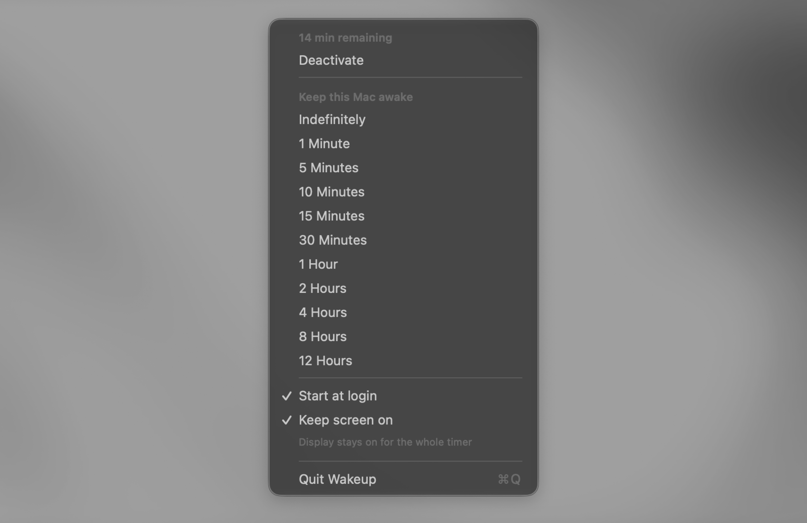

# Wakeup

A simple, free, and open-source macOS menu bar app that prevents your Mac from sleeping — inspired by Lungo.



## Features

- Keep your Mac awake for a chosen duration or indefinitely
- Live countdown in the menu bar (accurate across sleep/wake)
- Two modes:
  - **Keep screen on** — the display stays on for the whole timer
  - Screen off — the Mac stays awake but the display may turn off
- Duration presets, plus quick reset by re-picking any option
- Start at login
- Built-in **Check for Updates** via GitHub Releases
- Native SwiftUI menu-bar app, no Dock icon

## Install

1. Download the latest `Wakeup-x.y.z.dmg` from the
   [Releases page](https://github.com/kartikk-k/wakeup-mac/releases/latest).
2. Open the DMG and drag **Wakeup** into **Applications**.
3. Launch Wakeup — a coffee-cup icon appears in the menu bar.

> **First launch (unsigned builds):** if macOS says the app "can't be opened because
> Apple cannot check it," right-click the app → **Open** → **Open**. You only need to do
> this once. (Notarized releases don't show this warning.)

## Requirements

- macOS 13 Ventura or later
- Universal binary (Apple Silicon + Intel)

## Usage

- Click the menu-bar icon to open the menu.
- Pick a duration (or **Indefinitely**) to keep the Mac awake. Re-picking any option
  resets the timer to that duration.
- **Deactivate** turns it off and restores normal sleep behavior.
- **Keep screen on** — leave on to keep the display lit; turn off to let the screen
  sleep while the Mac stays awake.
- **Start at login** launches Wakeup automatically.
- **Check for Updates…** compares your version against the latest GitHub Release.

## How it works

Wakeup creates an in-process IOKit power-management assertion — the same mechanism the
system `caffeinate` tool uses — so it works without launching an external process:

- **Keep screen on** → `PreventUserIdleDisplaySleep`
- Screen off → `PreventUserIdleSystemSleep`

The countdown is derived from an absolute end time, so it stays accurate even if the
display or system sleeps and later wakes. When the timer expires or you deactivate, the
assertion is released and the Mac behaves normally.

## Building from source

1. Open `Wakeup.xcodeproj` in Xcode (16+).
2. Select the `Wakeup` scheme and Build & Run (⌘R).

To produce a distributable DMG, see [RELEASING.md](RELEASING.md):

```sh
./scripts/build_dmg.sh          # ad-hoc DMG (no Apple account)
```

## Updates

The app checks GitHub Releases at most once per day (toggleable) and offers to open the
release page when a newer version is available. Releases are cut by pushing a version tag
(`vX.Y.Z`); a GitHub Actions workflow builds, signs, notarizes, and attaches the DMG. See
[RELEASING.md](RELEASING.md).

## License

MIT — free and open source.

## Credits

Inspired by Lungo (by Sindre Sorhus / Setapp). An independent, open-source app.
